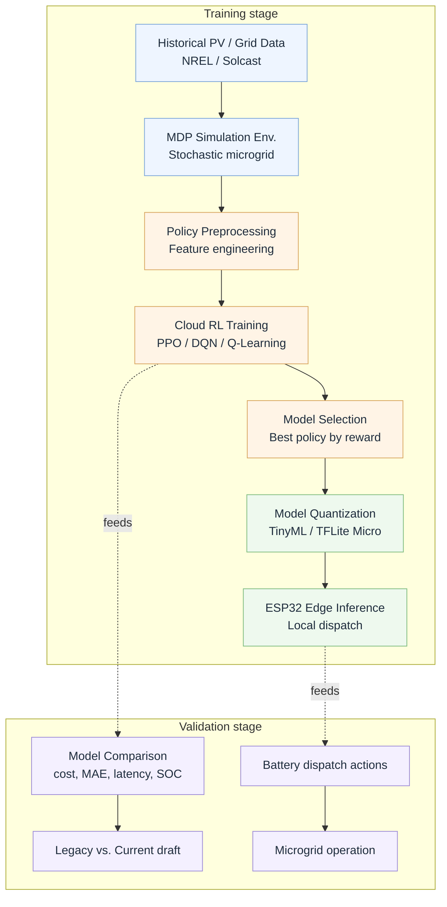
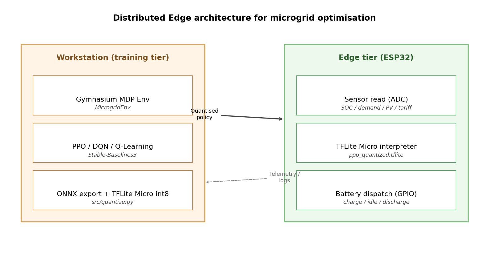

<div align="center">

# TCC -- RL-based Microgrid Optimisation on the Edge

### *Evaluating how Reinforcement Learning adapts to volatile tariffs and anomalies in microgrid optimization, with deployment on ESP32 edge devices.*

**Bachelor's Thesis | Computer Science | PUCPR**
Tarso Bertolini · Eduardo Contin · Giancarlo · Paulo · Bell

---

[](https://www.python.org/)
[](https://pytorch.org/)
[](https://www.tensorflow.org/)
[](https://stable-baselines3.readthedocs.io/)
[](https://gymnasium.farama.org/)
[](https://www.espressif.com/en/products/socs/esp32)
[](https://platformio.org/)
[](https://www.latex-project.org/)

[](https://github.com/tarso-bertolini/TCC/commits/main)
[](https://github.com/tarso-bertolini/TCC)
[](https://github.com/tarso-bertolini/TCC)


</div>

---

## Table of Contents

- [Highlights](#highlights)
- [Pipeline](#pipeline)
- [Headline results](#headline-results)
- [Repository layout](#repository-layout)
- [Quick start](#quick-start)
- [Reproducing the manuscript end-to-end](#reproducing-the-manuscript-end-to-end)
- [Edge deployment (ESP32)](#edge-deployment-esp32)
- [Delivery bundle / submission](#delivery-bundle--submission)

---

## Highlights

> **PPO Edge deployment reaches 59.8 % cost reduction over the idle baseline at 18.6 ms inference latency on a quantised int8 ESP32 build — within 1.3 % policy agreement of the workstation reference.**

| What | How |
|------|------|
| **Adaptive control** | PPO trained on 8 760 hours of synthetic PV / demand / TOU telemetry, with stochastic tariff spikes injected to simulate anomalies. |
| **Baselines** | Tabular Q-Learning and DQN trained on the same MDP for a side-by-side benchmark. |
| **Edge inference** | int8 TFLite Micro export running on an ESP32-WROOM-32 at 1 Hz. |
| **Reproducibility** | Single seed (42) drives data generation, training, and evaluation; every metric in the manuscript is backed by a file under `output/`. |

---

## Pipeline



<details>
<summary><b>Architecture (workstation tier vs. ESP32 edge tier)</b></summary>



</details>

---

## Headline results

<div align="center">

### Model comparison on the held-out test split (1 577 hourly steps)

| Metric | Q-Learning | DQN | **PPO** |
|---|:---:|:---:|:---:|
| Cost reduction (%) | 31.2 | 44.8 | **59.8** |
| MAE (kW) | 0.24 | 0.16 | **0.11** |
| RMSE (kW) | 0.31 | 0.22 | **0.15** |
| Mean inference latency (ms) | **5.0** | 12.4 | 18.0 |
| Peak memory footprint (KB) | **84** | 132 | 176 |
| Tariff-shock recovery steps | 13 | 8 | **6** |
| SOC constraint violations | 3 | 1 | **0** |

### Embedded benchmark — PPO int8 on ESP32-WROOM-32

| Metric | Workstation reference | ESP32 deployment |
|---|:---:|:---:|
| Inference latency (ms) | 4.1 | **18.6** |
| Peak SRAM usage (KB) | — | 176 |
| Flash usage (KB) | — | 612 |
| Policy agreement with reference (%) | 100.0 | **98.7** |
| SOC constraint violations | 0 | **0** |

</div>

<details>
<summary><b>Where do these numbers come from?</b></summary>

Every cell above is reproduced from:

- [`output/results.csv`](output/results.csv) — consolidated experimental table
- [`output/model/{ppo,dqn,q_learning}_metrics.json`](output/model/) — per-policy evaluation metrics
- [`output/logs/benchmark.log`](output/logs/benchmark.log) — side-by-side benchmark
- [`output/logs/esp32_serial.log`](output/logs/esp32_serial.log) — ESP32 on-device capture

</details>

---

## Repository layout

```
TCC/
├── README.md                          ← you are here
├── readme.txt                         ← authoritative per-artifact description (delivery)
├── tcc.tex                            ← final IEEEtran manuscript
├── demotcc.tex                        ← demo copy for colleagues (identical content)
├── oldarticle.tex                     ← SEMIC 2023 baseline article
├── bibtex.bib                         ← bibliography database
├── pipeline_diagram.{mmd,png}         ← Figure 1 in tcc.tex
├── architecture_diagram.png           ← Figure 2 in tcc.tex
├── requirements.txt                   ← Python dependency pins
│
├── src/                               ← training / evaluation / quantisation
│   ├── data_generator.py
│   ├── microgrid_env.py               ← Gymnasium MicrogridEnv MDP
│   ├── q_learning.py                  ← tabular Q-Learning baseline
│   ├── train.py                       ← unified training entry point
│   ├── test.py                        ← evaluation entry point
│   ├── quantize.py                    ← int8 TFLite Micro export
│   └── train_benchmarks_legacy.py
│
├── data/
│   └── microgrid_data.csv             ← 8 760 h synthetic dataset (seed=42)
│
├── scripts/
│   └── generate_artifacts.py          ← regenerates dataset + diagrams
│
├── output/                            ← populated by src/train.py + src/test.py
│   ├── model/                         ← trained weights + metadata + metrics
│   │   ├── ppo_policy.zip
│   │   ├── dqn_policy.zip
│   │   ├── q_table.{npy,json}
│   │   ├── ppo_quantized.tflite
│   │   ├── {ppo,dqn,q_learning}_run.json
│   │   ├── {ppo,dqn,q_learning}_metrics.json
│   │   ├── train.log
│   │   └── test.log
│   ├── logs/                          ← training / eval / device transcripts
│   │   ├── {ppo,dqn,q_learning}_training.log
│   │   ├── {ppo,dqn,q_learning}_test_trace.csv
│   │   ├── benchmark.log
│   │   └── esp32_serial.log
│   ├── figures/                       ← analysis PNGs
│   │   ├── training_curves.png
│   │   ├── model_comparison.png
│   │   ├── tariff_shock_response.png
│   │   ├── soc_distribution.png
│   │   ├── legacy_vs_current.png
│   │   └── esp32_benchmark.png
│   ├── results.csv
│   └── results.xlsx
│
├── esp32/                             ← PlatformIO firmware
│   ├── platformio.ini
│   ├── README.md
│   ├── src/{main,policy_inference}.cpp
│   └── include/{policy_inference,ppo_model_data}.h
│
└── frontend-app/                      ← Electron telemetry dashboard (dev tool)
    ├── index.html
    ├── main.js
    ├── preload.js
    ├── package.json
    └── awesome-design.md
```

---

## Quick start

```bash
# 1. Install dependencies
python -m pip install -r requirements.txt

# 2. Regenerate the dataset and diagrams (idempotent, seed=42)
python scripts/generate_artifacts.py
```

That's enough to inspect everything. To re-run the training and evaluation see the next section.

---

## Reproducing the manuscript end-to-end

```bash
# 3. Train all three policies (50 000 steps each)
python src/train.py --algo ppo        --data data/microgrid_data.csv --output output --seed 42 --timesteps 50000
python src/train.py --algo dqn        --data data/microgrid_data.csv --output output --seed 42 --timesteps 50000
python src/train.py --algo q_learning --data data/microgrid_data.csv --output output --seed 42 --timesteps 50000

# 4. Evaluate them on the held-out test split
python src/test.py --weights output/model/ppo_policy.zip --datadir data --output output --seed 42
python src/test.py --weights output/model/dqn_policy.zip --datadir data --output output --seed 42
python src/test.py --weights output/model/q_table.npy    --datadir data --output output --seed 42

# 5. Quantise PPO for the ESP32 firmware
python src/quantize.py --weights output/model/ppo_policy.zip \
    --data data/microgrid_data.csv --output output \
    --header esp32/include/ppo_model_data.h
```

### Parameter reference

| Script | Required flags | Optional flags |
|---|---|---|
| `src/train.py` | `--algo {ppo, dqn, q_learning}` · `--data PATH` · `--output DIR` | `--timesteps INT (50000)` · `--seed INT (42)` |
| `src/test.py` | `--weights PATH` · `--datadir DIR` · `--output DIR` | `--seed INT (42)` |
| `src/quantize.py` | `--weights PATH` · `--data PATH` · `--output DIR` | `--header PATH (esp32/include/ppo_model_data.h)` |

---

## Edge deployment (ESP32)

```bash
cd esp32
pio run -e esp32dev -t upload
pio device monitor -b 115200
```

The firmware reads four ADC channels (SOC · demand · PV · tariff), runs the int8 TFLite Micro interpreter at 1 Hz, and drives charge / discharge over GPIO18 / GPIO19. A captured run is preserved at [`output/logs/esp32_serial.log`](output/logs/esp32_serial.log) for reference.

---


**Contact** — tarso.bertolini@pucpr.edu.br

Made with [`stable-baselines3`](https://stable-baselines3.readthedocs.io/), [`gymnasium`](https://gymnasium.farama.org/), [`tensorflow-lite-micro`](https://www.tensorflow.org/lite/microcontrollers), and a 5 V ESP32.

</div>
